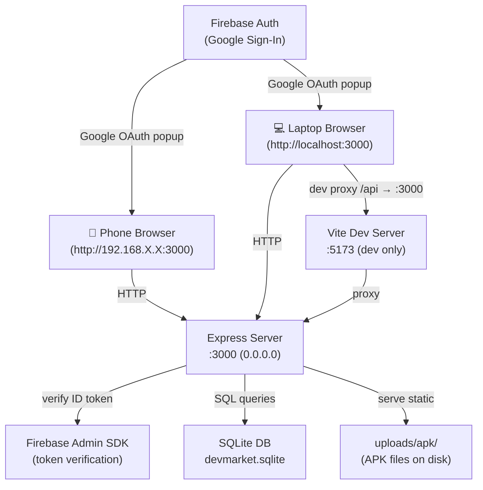
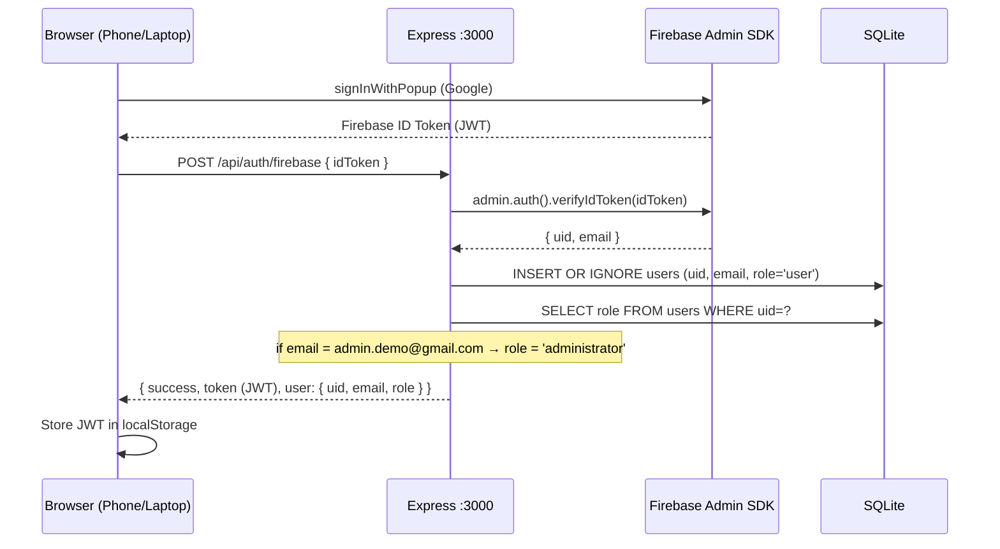

# Design Document: APK Platform Finalization

## Overview

The DevMarket APK hosting platform is a mobile-first web application that allows developers to upload Android APKs, admins to review and approve them, and users to browse and download approved apps — all over a local network (laptop server + phone client). The project has a React/Vite frontend (`/client`) and an Express/Node backend (`/server`) that are partially implemented and need to be completed, fixed, and integrated into a fully working demo-ready system.

The core gap is a **mismatch between the frontend's expectations and the backend's actual API contracts**, combined with a broken Firebase authentication flow, missing admin user-management UI, and a non-functional APK download path on the phone. This design resolves all of those gaps without redesigning the existing UI.

---

## Architecture



### Request Flow (Production / Demo)



---

## Components and Interfaces

### Component 1: Firebase Auth Integration (Frontend)

**Purpose**: Replace the current `@react-oauth/google` OAuth2 access-token flow with Firebase `signInWithPopup`, obtain a Firebase ID token, and send it to the backend.

**Current state**: `AuthContext.jsx` uses `onAuthStateChanged` and `signInWithPopup` correctly, but `Login.jsx` still uses `@react-oauth/google`'s `useGoogleLogin` hook (access token, not ID token). The backend endpoint `/api/auth/google` does not exist — only `/api/auth/me` exists.

**Interface** (updated `AuthContext.jsx`):
```typescript
interface AuthContextValue {
  user: { uid: string; email: string; role: string; name?: string } | null
  token: string | null          // JWT issued by our backend (not Firebase token)
  login: () => Promise<void>    // triggers Firebase Google popup → calls /api/auth/firebase
  logout: () => Promise<void>
  isAuthenticated: boolean
  isAdmin: boolean              // derived from user.role === 'administrator'
  isDeveloper: boolean          // derived from user.role === 'developer'
  loading: boolean
}
```

**Responsibilities**:
- Call `signInWithPopup(auth, googleProvider)` to get Firebase credential
- Extract ID token via `firebaseUser.getIdToken()`
- POST to `/api/auth/firebase` with `{ idToken }`
- Store the returned backend JWT in `localStorage` under `devmarket_auth`
- Expose `isAdmin` and `isDeveloper` flags derived from `user.role`

---

### Component 2: Auth Backend Endpoint

**Purpose**: Accept a Firebase ID token, verify it, upsert the user in SQLite, enforce the demo admin rule, and return a signed JWT.

**Current state**: The route `/api/auth/google` is referenced in `Login.jsx` but does not exist in `server/routes/auth.js`. The existing `verifyToken` middleware already does the upsert logic — it just needs a dedicated login endpoint.

**Interface**:
```typescript
// POST /api/auth/firebase
Request:  { idToken: string }
Response: {
  success: true,
  token: string,          // JWT signed with process.env.JWT_SECRET
  user: { uid, email, role, name }
}
```

**Responsibilities**:
- Verify Firebase ID token with `admin.auth().verifyIdToken(idToken)`
- Upsert user in `users` table (INSERT OR IGNORE)
- If `email === process.env.DEMO_ADMIN_EMAIL` → `UPDATE users SET role = 'administrator'`
- Sign and return a JWT containing `{ uid, email, role }`

---

### Component 3: JWT Auth Middleware (Backend)

**Purpose**: Protect API routes by verifying the backend-issued JWT (not the Firebase token directly on every request).

**Current state**: `authMiddleware.js` calls `admin.auth().verifyIdToken()` on every request, which requires a live Firebase connection for every API call. This is fragile on a local network demo. The middleware should verify the backend JWT instead.

**Interface**:
```typescript
// middleware signature
verifyToken(req, res, next): void
// populates req.user = { uid, email, role }

requireAdmin(req, res, next): void
// passes if req.user.role === 'administrator'

requireDeveloper(req, res, next): void
// passes if req.user.role === 'developer' || 'administrator'
```

---

### Component 4: Admin Panel — User Management

**Purpose**: Allow admins to view all users and promote a user to developer role.

**Current state**: `AdminPanel.jsx` only shows pending apps. The backend has `PUT /api/admin/users/:uid/promote` but the frontend never calls it. There is no UI to list users.

**Interface**:
```typescript
// GET /api/admin/users
Response: { success: true, users: Array<{ uid, email, role, created_at }> }

// PUT /api/admin/users/:uid/promote
Response: { success: true }
```

**Responsibilities**:
- Add a "Users" tab to `AdminPanel.jsx` alongside the existing "Apps" tab
- Render a list of users with a "Promote to Developer" button for `role === 'user'`
- Call `PUT /api/admin/users/:uid/promote` on click

---

### Component 5: APK Upload (Developer Dashboard)

**Purpose**: Allow developers to upload an APK file directly from the browser (including phone browser).

**Current state**: `DevDashboard.jsx` has a form that calls `apiUpload("/apps/upload-apk", formData)` but the backend route is `POST /api/apps/upload`. The form also references undefined variables (`apkUrl`, `Link2`) — it has a broken mix of file-upload and URL-input approaches.

**Interface**:
```typescript
// POST /api/apps/upload  (multipart/form-data)
Fields: { name: string, description: string, category: string, version: string }
File:   apk (field name)
Response: { success: true, app: { id, name, filename, status: 'pending' } }
```

**Responsibilities**:
- Fix `DevDashboard.jsx` to use a `<input type="file" accept=".apk">` field
- Submit via `apiUpload("/apps/upload", formData)` (correct route)
- Backend `appController.uploadApp` already handles multer — add `description`, `category`, `version` columns to the `apps` table

---

### Component 6: APK Download (User View)

**Purpose**: Let users browse approved apps and download the APK directly to their phone.

**Current state**: `AppDetailsPage.jsx` shows a fake download progress sheet. The "Install" button does not trigger a real download. The backend serves files at `/downloads/:filename` with `Content-Disposition: attachment`.

**Interface**:
```typescript
// GET /api/apps  →  returns approved apps with downloadUrl
// GET /downloads/:filename  →  streams APK file with Content-Disposition: attachment

// Frontend: trigger download
window.location.href = app.downloadUrl
// or
<a href={app.downloadUrl} download>Install</a>
```

**Responsibilities**:
- Replace the fake download sheet in `AppDetailsPage.jsx` with a real download link
- `downloadUrl` is already constructed in `appController.getApp` as `http://${LAN_IP}:3000/downloads/${filename}`
- The phone must be on the same network as the laptop

---

### Component 7: Test Data Seed

**Purpose**: Ensure a "Demo App" APK exists in the database and on disk so the demo works without a developer uploading first.

**Interface**:
```typescript
// server/config/initDb.js — seed function
async function seedDemoData(): Promise<void>
// Inserts demo admin user and Demo App if not already present
// Copies a placeholder APK to uploads/apk/demo-app.apk
```

---

## Data Models

### SQLite Schema (updated)

```sql
-- users table (existing, no change needed)
CREATE TABLE IF NOT EXISTS users (
  uid        VARCHAR(128) PRIMARY KEY,
  email      VARCHAR(255) NOT NULL UNIQUE,
  role       TEXT CHECK(role IN ('user', 'developer', 'administrator')) NOT NULL DEFAULT 'user',
  created_at TIMESTAMP NOT NULL DEFAULT CURRENT_TIMESTAMP
);

-- apps table (add missing columns)
CREATE TABLE IF NOT EXISTS apps (
  id             INTEGER PRIMARY KEY AUTOINCREMENT,
  developer_uid  VARCHAR(128) NOT NULL,
  name           VARCHAR(255) NOT NULL,
  description    TEXT         NOT NULL DEFAULT '',
  category       VARCHAR(100) NOT NULL DEFAULT 'Other',
  version        VARCHAR(50)  NOT NULL DEFAULT '1.0',
  filename       VARCHAR(255) NOT NULL,
  status         TEXT CHECK(status IN ('pending', 'approved', 'rejected')) NOT NULL DEFAULT 'pending',
  uploaded_at    TIMESTAMP NOT NULL DEFAULT CURRENT_TIMESTAMP,
  FOREIGN KEY (developer_uid) REFERENCES users(uid)
);
```

### User Object (in-memory / JWT payload)

```typescript
interface User {
  uid: string           // Firebase UID
  email: string
  role: 'user' | 'developer' | 'administrator'
  name?: string         // from Firebase display name
}
```

### App Object (API response)

```typescript
interface App {
  id: number
  developer_uid: string
  name: string
  description: string
  category: string
  version: string
  filename: string
  status: 'pending' | 'approved' | 'rejected'
  uploaded_at: string   // ISO timestamp
  downloadUrl: string   // http://{LAN_IP}:3000/downloads/{filename}
}
```

---

## API Endpoints Overview

| Method | Path | Auth | Role | Description |
|--------|------|------|------|-------------|
| POST | `/api/auth/firebase` | None | — | Exchange Firebase ID token for backend JWT |
| GET | `/api/auth/me` | JWT | any | Get current user profile |
| GET | `/api/apps` | JWT | any | List all approved apps |
| GET | `/api/apps/:id` | JWT | any | Get single approved app |
| POST | `/api/apps/upload` | JWT | developer/admin | Upload APK (multipart) |
| GET | `/api/admin/apps/pending` | JWT | admin | List pending apps |
| PUT | `/api/admin/apps/:id/approve` | JWT | admin | Approve app |
| PUT | `/api/admin/apps/:id/reject` | JWT | admin | Reject app |
| GET | `/api/admin/users` | JWT | admin | List all users |
| PUT | `/api/admin/users/:uid/promote` | JWT | admin | Promote user → developer |
| GET | `/downloads/:filename` | None | — | Download APK file (attachment) |

---

## Algorithmic Pseudocode

### Main Algorithm: Firebase Login Flow

```pascal
PROCEDURE handleFirebaseLogin()
  INPUT: none (triggers Google popup)
  OUTPUT: authenticated session with backend JWT

  SEQUENCE
    credential ← signInWithPopup(auth, googleProvider)
    firebaseUser ← credential.user
    idToken ← await firebaseUser.getIdToken()

    response ← POST /api/auth/firebase { idToken }

    IF response.success THEN
      localStorage.set('devmarket_auth', { token: response.token })
      setUser(response.user)
      navigate('/')
    ELSE
      setError(response.message)
    END IF
  END SEQUENCE
END PROCEDURE
```

**Preconditions:**
- Firebase is initialised with valid `VITE_FIREBASE_*` env vars
- Backend is reachable at `VITE_API_BASE_URL`

**Postconditions:**
- `localStorage['devmarket_auth']` contains `{ token: <backend JWT> }`
- `user.role` reflects the role stored in SQLite

---

### Main Algorithm: Backend Token Exchange

```pascal
PROCEDURE firebaseAuthEndpoint(req, res)
  INPUT: req.body.idToken (Firebase ID token string)
  OUTPUT: JSON { success, token, user }

  SEQUENCE
    decoded ← admin.auth().verifyIdToken(req.body.idToken)
    uid ← decoded.uid
    email ← decoded.email
    name ← decoded.name

    // Upsert user
    EXECUTE "INSERT OR IGNORE INTO users (uid, email, role) VALUES (?, ?, 'user')"
      WITH [uid, email]

    // Enforce demo admin
    IF email = DEMO_ADMIN_EMAIL THEN
      EXECUTE "UPDATE users SET role = 'administrator' WHERE uid = ?"
        WITH [uid]
    END IF

    row ← EXECUTE "SELECT role FROM users WHERE uid = ?" WITH [uid]
    role ← row.role

    jwt ← sign({ uid, email, role }, JWT_SECRET, { expiresIn: '7d' })

    RETURN { success: true, token: jwt, user: { uid, email, role, name } }
  END SEQUENCE
END PROCEDURE
```

**Preconditions:**
- `req.body.idToken` is a non-empty string
- Firebase Admin SDK is initialised

**Postconditions:**
- User exists in `users` table with correct role
- Returned JWT is valid for 7 days

---

### Main Algorithm: APK Upload

```pascal
PROCEDURE uploadApk(req, res)
  INPUT: req.file (APK), req.body.{ name, description, category, version }
  OUTPUT: JSON { success, app }

  SEQUENCE
    // multer processes the file upload
    IF req.file IS NULL THEN
      RETURN 400 { success: false, message: 'No file uploaded' }
    END IF

    IF req.file.size > 200MB THEN
      RETURN 413 { success: false, message: 'File too large' }
    END IF

    filename ← req.file.filename  // e.g. "1720000000000-myapp.apk"
    developer_uid ← req.user.uid

    result ← EXECUTE
      "INSERT INTO apps (developer_uid, name, description, category, version, filename, status)
       VALUES (?, ?, ?, ?, ?, ?, 'pending')"
      WITH [developer_uid, name, description, category, version, filename]

    RETURN 201 { success: true, app: { id: result.lastInsertRowid, name, filename, status: 'pending' } }
  END SEQUENCE
END PROCEDURE
```

**Preconditions:**
- `req.user.role` is 'developer' or 'administrator' (enforced by `requireDeveloper` middleware)
- `uploads/apk/` directory exists and is writable

**Postconditions:**
- APK file is stored at `uploads/apk/{filename}`
- App record exists in DB with `status = 'pending'`

---

### Main Algorithm: Admin Approve/Reject

```pascal
PROCEDURE approveApp(req, res)
  INPUT: req.params.id (app ID)
  OUTPUT: JSON { success }

  SEQUENCE
    result ← EXECUTE "UPDATE apps SET status = 'approved' WHERE id = ?" WITH [id]

    IF result.changes = 0 THEN
      RETURN 404 { success: false, message: 'App not found' }
    END IF

    RETURN { success: true }
  END SEQUENCE
END PROCEDURE

PROCEDURE rejectApp(req, res)
  // identical but sets status = 'rejected'
END PROCEDURE
```

---

### Main Algorithm: Promote User

```pascal
PROCEDURE promoteUser(req, res)
  INPUT: req.params.uid (user UID)
  OUTPUT: JSON { success }

  SEQUENCE
    result ← EXECUTE "UPDATE users SET role = 'developer' WHERE uid = ?" WITH [uid]

    IF result.changes = 0 THEN
      RETURN 404 { success: false, message: 'User not found' }
    END IF

    RETURN { success: true }
  END SEQUENCE
END PROCEDURE
```

---

## Key Functions with Formal Specifications

### `POST /api/auth/firebase` handler

**Preconditions:**
- `req.body.idToken` is a valid Firebase ID token (not expired)
- Firebase Admin SDK is initialised with a valid service account

**Postconditions:**
- User row exists in `users` table
- If `email === DEMO_ADMIN_EMAIL`, role is `'administrator'`
- Response contains a signed JWT with `{ uid, email, role }` payload

**Loop Invariants:** N/A

---

### `verifyToken` middleware (updated)

**Preconditions:**
- `Authorization: Bearer <jwt>` header is present
- `JWT_SECRET` env var is set

**Postconditions:**
- `req.user = { uid, email, role }` is populated
- Returns 401 if token is missing, malformed, or expired

---

### `uploadApp` controller

**Preconditions:**
- `req.user.role` is `'developer'` or `'administrator'`
- `req.file` is a valid `.apk` file ≤ 200 MB
- `req.body.name` is non-empty

**Postconditions:**
- File saved to `uploads/apk/{timestamp}-{originalname}`
- DB row inserted with `status = 'pending'`
- Returns `201` with app object

**Loop Invariants:** N/A

---

### `seedDemoData` function

**Preconditions:**
- DB tables exist (called after `initDb()`)
- `uploads/apk/` directory exists

**Postconditions:**
- A user row with `email = DEMO_ADMIN_EMAIL` and `role = 'administrator'` exists
- An app row with `name = 'Demo App'`, `status = 'approved'`, `filename = 'demo-app.apk'` exists
- `uploads/apk/demo-app.apk` exists (minimal valid file or placeholder)

---

## Error Handling

### Error Scenario 1: Firebase token verification failure

**Condition**: `admin.auth().verifyIdToken()` throws (expired, revoked, or invalid token)
**Response**: `401 { success: false, message: 'Unauthorized' }`
**Recovery**: Frontend catches 401, clears localStorage, redirects to `/login`

### Error Scenario 2: APK file too large

**Condition**: Uploaded file exceeds 200 MB multer limit
**Response**: `413 { success: false, message: 'File too large' }`
**Recovery**: Frontend shows error message in the upload form

### Error Scenario 3: Non-APK file uploaded

**Condition**: `fileFilter` rejects file (not `.apk` extension or MIME type)
**Response**: `400 { success: false, message: 'Only APK files are allowed' }`
**Recovery**: Frontend shows error message

### Error Scenario 4: Admin action on non-existent app/user

**Condition**: `UPDATE` affects 0 rows
**Response**: `404 { success: false, message: 'App not found' }` or `'User not found'`
**Recovery**: Frontend removes stale item from list and shows a toast

### Error Scenario 5: Phone cannot reach server

**Condition**: `LAN_IP` in `.env` is wrong or phone is on a different network
**Response**: Network error (no response)
**Recovery**: User must ensure phone and laptop are on the same hotspot; update `LAN_IP` in `.env` and `VITE_API_BASE_URL` in client `.env`

---

## Testing Strategy

### Full Demo Workflow (Manual)

1. Login as `admin.demo@gmail.com` via Google → verify admin panel is accessible
2. Login as a regular Google account → verify user role, no admin/dev access
3. Admin promotes user → user re-logs in → verify developer role
4. Developer uploads APK → verify "pending" status in admin panel
5. Admin approves APK → verify app appears on home page
6. User (on phone) opens `http://192.168.X.X:3000` → browses app → taps Install → APK downloads

### Unit Testing Approach

Key units to test:
- `firebaseAuthEndpoint`: mock `admin.auth().verifyIdToken`, verify upsert logic and admin email rule
- `uploadApp`: mock multer and DB, verify correct status and filename storage
- `approveApp` / `rejectApp`: verify DB update and 404 on missing ID
- `promoteUser`: verify role update and 404 on missing UID
- `verifyToken` middleware: verify JWT validation and `req.user` population

### Property-Based Testing Approach

**Property Test Library**: fast-check (already in devDependencies)

Properties to test:
- For any valid Firebase UID + email pair, `firebaseAuthEndpoint` always returns a JWT containing the same UID
- For any app ID that exists in DB with `status = 'pending'`, `approveApp` always sets `status = 'approved'`
- For any user UID with `role = 'user'`, `promoteUser` always sets `role = 'developer'`
- `verifyToken` with any string that is not a valid JWT always returns 401

### Integration Testing Approach

- Use `supertest` against the Express app with SQLite in-memory
- Test the full login → upload → approve → download chain
- Verify CORS headers allow requests from `http://192.168.X.X:*`

---

## Performance Considerations

- SQLite is sufficient for a local demo (single-user concurrency)
- APK files are served via `express.static` with `Content-Disposition: attachment` — no streaming overhead for demo-sized files
- Vite proxy (`/api → :3000`) is only used in dev mode; production serves everything from Express on port 3000

---

## Security Considerations

- Firebase ID tokens are verified server-side on login only; subsequent requests use a short-lived backend JWT
- `JWT_SECRET` must be set in `.env` (not committed to git)
- `firebase-service-account.json` is already in `.gitignore`
- The demo admin email (`admin.demo@gmail.com`) is enforced server-side — the client cannot self-assign admin role
- `uploads/apk/` is served as static files with no directory listing (`fallthrough: false`)
- CORS is open (`*`) for LAN demo convenience; should be restricted in production

---

## Dependencies

### Backend (already in `package.json`)
- `express` — HTTP server
- `firebase-admin` — Firebase ID token verification
- `better-sqlite3` — SQLite database
- `multer` — multipart file upload handling
- `jsonwebtoken` — backend JWT signing/verification
- `cors` — CORS middleware
- `dotenv` — environment variable loading

### Frontend (already in `client/package.json`)
- `firebase` — Google Sign-In via `signInWithPopup`
- `react-router` — client-side routing
- `lucide-react` — icons
- `motion` — animations (existing)

### New env vars required (add to `.env` and `.env.example`)
```
JWT_SECRET=your_random_secret_here
DEMO_ADMIN_EMAIL=admin.demo@gmail.com
VITE_FIREBASE_API_KEY=...
VITE_FIREBASE_AUTH_DOMAIN=...
VITE_FIREBASE_PROJECT_ID=...
VITE_FIREBASE_APP_ID=...
```


---

## Correctness Properties

*A property is a characteristic or behavior that should hold true across all valid executions of a system — essentially, a formal statement about what the system should do. Properties serve as the bridge between human-readable specifications and machine-verifiable correctness guarantees.*

### Property 1: JWT payload round-trip

*For any* valid `{ uid, email, role }` triple returned by the backend login endpoint, decoding the returned JWT with `JWT_SECRET` should produce a payload containing the same `uid`, `email`, and `role` values.

**Validates: Requirements 2.4, 2.5**

---

### Property 2: verifyToken populates req.user correctly

*For any* valid backend JWT containing `{ uid, email, role }`, the `verifyToken` middleware should populate `req.user` with exactly those values and call `next()`.

**Validates: Requirements 3.1**

---

### Property 3: Invalid auth header always returns 401

*For any* string that is not a well-formed `Bearer <valid-jwt>` header (including missing header, empty string, non-JWT token, expired token), the `verifyToken` middleware should return HTTP 401.

**Validates: Requirements 3.2, 3.3**

---

### Property 4: Non-admin role always blocked by requireAdmin

*For any* `req.user` where `role` is `'user'` or `'developer'`, the `requireAdmin` middleware should return HTTP 403.

**Validates: Requirements 3.5, 4.7**

---

### Property 5: Non-developer role always blocked by requireDeveloper

*For any* `req.user` where `role` is `'user'`, the `requireDeveloper` middleware should return HTTP 403.

**Validates: Requirements 3.7, 6.8**

---

### Property 6: App approval sets status to approved

*For any* app ID that exists in the database with `status = 'pending'`, calling `approveApp` should result in that app having `status = 'approved'` when subsequently queried.

**Validates: Requirements 4.4**

---

### Property 7: App rejection sets status to rejected

*For any* app ID that exists in the database with `status = 'pending'`, calling `rejectApp` should result in that app having `status = 'rejected'` when subsequently queried.

**Validates: Requirements 4.5**

---

### Property 8: User promotion sets role to developer

*For any* user UID that exists in the database with `role = 'user'`, calling `promoteUser` should result in that user having `role = 'developer'` when subsequently queried.

**Validates: Requirements 5.5**

---

### Property 9: APK upload always creates a pending record

*For any* valid APK file upload with non-empty `name`, `description`, `category`, and `version` fields, the resulting database record should have `status = 'pending'` and the `filename` should match the file saved to `uploads/apk/`.

**Validates: Requirements 6.2, 6.3, 6.4**

---

### Property 10: GET /api/apps only returns approved apps with downloadUrl

*For any* database state containing a mix of `pending`, `approved`, and `rejected` apps, `GET /api/apps` should return only apps with `status = 'approved'`, and every returned app should have a non-empty `downloadUrl` field.

**Validates: Requirements 7.1**

---

### Property 11: downloadUrl contains LAN_IP or localhost fallback

*For any* approved app, the `downloadUrl` field should be of the form `http://{LAN_IP}:3000/downloads/{filename}` where `LAN_IP` is the configured value, or `http://localhost:3000/downloads/{filename}` when `LAN_IP` is not set.

**Validates: Requirements 7.1, 7.2, 10.4**

---

### Property 12: initDb is idempotent

*For any* number of consecutive calls to `initDb`, the resulting database schema should be identical — no duplicate tables, no missing columns, no errors.

**Validates: Requirements 8.4**

---

### Property 13: Seed is idempotent

*For any* number of consecutive calls to the seed function, the database should contain exactly one demo admin user and exactly one Demo App record — no duplicates, no errors.

**Validates: Requirements 9.1, 9.2, 9.4**

---

### Property 14: AuthContext role flags are consistent with user.role

*For any* user object stored in `AuthContext`, `isAdmin` should be `true` if and only if `user.role === 'administrator'`, and `isDeveloper` should be `true` if and only if `user.role === 'developer'`.

**Validates: Requirements 1.6, 1.7**
