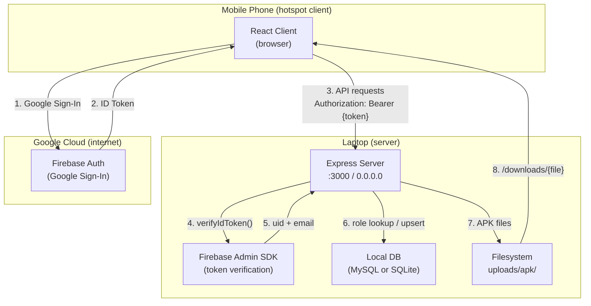

# Design Document: LAN Backend Setup

## Overview

DevMarket is being migrated from a cloud-hosted MongoDB/JWT architecture to a fully local, LAN-based system. The laptop acts as both the server and file host; mobile phones connect over a shared Wi-Fi hotspot. This design replaces:

- **MongoDB** → MySQL (primary) or SQLite (fallback)
- **Custom JWT auth** → Firebase Authentication (Google Sign-In) + Firebase Admin SDK token verification
- **Cloud deployment** → `0.0.0.0:3000` binding on the laptop, reachable at `http://{LAN_IP}:3000`

The existing Express server structure (`server/`) is preserved and refactored in-place. The React client (`client/`) is updated to use Firebase Sign-In and a configurable API base URL.

### Key Design Decisions

1. **Firebase Auth over custom JWT**: Eliminates password storage and bcrypt, delegates identity to Google. The server only verifies tokens — it never issues them.
2. **MySQL with SQLite fallback**: MySQL is the production-grade choice for a LAN server; SQLite requires zero setup and is the fallback for quick demos (`DB_TYPE=sqlite`).
3. **Port 3000 instead of 5000**: Aligns with the requirements spec. The existing `.env.example` uses 5000 — this will be updated.
4. **Static APK serving via Express**: Files in `uploads/apk/` are served directly under `/downloads`, keeping the download URL construction simple and self-contained.

---

## Architecture



### Request Lifecycle

1. Client obtains a Firebase ID Token via Google Sign-In.
2. Every API request carries `Authorization: Bearer {ID_Token}`.
3. `authMiddleware` calls `firebaseAdmin.auth().verifyIdToken()`.
4. On success, `uid` and `email` are used to upsert the user in Local_DB and attach `role` to `req.user`.
5. Role-guard middleware (`requireAdmin`, `requireDeveloper`) checks `req.user.role` before routing.
6. Controllers interact with Local_DB via a thin query helper (mysql2/promise or better-sqlite3).

---

## Components and Interfaces

### Server Components

#### `server/config/db.js` — Database Adapter

Exports a unified `query(sql, params)` function. Internally selects the driver based on `DB_TYPE` env var.

```js
// MySQL mode (default)
const pool = mysql2.createPool({ host, user, password, database });
export const query = (sql, params) => pool.execute(sql, params);

// SQLite mode (DB_TYPE=sqlite)
const db = new Database(process.env.DB_PATH || './devmarket.sqlite');
export const query = (sql, params) => { /* wrap sync API in promise */ };
```

#### `server/config/firebase.js` — Firebase Admin Initializer

```js
import admin from 'firebase-admin';
admin.initializeApp({
  credential: admin.credential.cert(require(process.env.FIREBASE_SERVICE_ACCOUNT_PATH))
});
export default admin;
```

#### `server/middleware/authMiddleware.js` — Token Verification + Role Attachment

Replaces the existing JWT-based middleware. Three exports:

| Export | Behaviour |
|---|---|
| `verifyToken` | Calls `admin.auth().verifyIdToken()`, upserts user in DB, attaches `req.user = { uid, email, role }` |
| `requireAdmin` | Checks `req.user.role === 'admin'`, returns 403 otherwise |
| `requireDeveloper` | Checks `role === 'developer' \|\| role === 'admin'`, returns 403 otherwise |

#### `server/controllers/authController.js` — User Info Endpoint

`GET /api/auth/me` — returns the current user's profile (uid, email, role) from Local_DB. No login/register endpoints needed; Firebase handles identity.

#### `server/controllers/appController.js` — APK Upload + Listing

| Method | Path | Auth | Description |
|---|---|---|---|
| POST | `/api/apps/upload` | Developer | Multer upload → DB insert (status=pending) |
| GET | `/api/apps` | Any authenticated | Returns approved apps with `downloadUrl` |
| GET | `/api/apps/:id` | Any authenticated | Single app detail with `downloadUrl` |

#### `server/controllers/adminController.js` — Admin Actions

| Method | Path | Auth | Description |
|---|---|---|---|
| GET | `/api/admin/apps/pending` | Admin | List pending apps |
| PUT | `/api/admin/apps/:id/approve` | Admin | Set status=approved |
| PUT | `/api/admin/apps/:id/reject` | Admin | Set status=rejected |
| PUT | `/api/admin/users/:uid/promote` | Admin | Set role=developer |

#### `server/index.js` — Entry Point

- Binds to `0.0.0.0:3000`
- Logs `LAN_IP` and port on startup
- Configures CORS (wildcard or `CORS_ORIGIN` env var)
- Mounts `/downloads` static route pointing to `uploads/apk/`
- Serves `client/dist` for the SPA fallback

### Client Components

#### `client/src/api/client.js` — API Base URL

Updated to read `VITE_API_BASE_URL` from the environment:

```js
const API_BASE = import.meta.env.VITE_API_BASE_URL || '/api';
```

#### `client/src/context/AuthContext.jsx` — Firebase Sign-In

Replaces the existing email/password login flow with Firebase Google Sign-In. Stores the Firebase ID Token (refreshed automatically) and sends it on every request.

---

## Data Models

### `users` Table

```sql
CREATE TABLE IF NOT EXISTS users (
  uid        VARCHAR(128)                          PRIMARY KEY,
  email      VARCHAR(255)                          NOT NULL UNIQUE,
  role       ENUM('user', 'developer', 'admin')    NOT NULL DEFAULT 'user',
  created_at TIMESTAMP                             NOT NULL DEFAULT CURRENT_TIMESTAMP
);
```

### `apps` Table

```sql
CREATE TABLE IF NOT EXISTS apps (
  id             INT AUTO_INCREMENT PRIMARY KEY,
  developer_uid  VARCHAR(128)  NOT NULL,
  name           VARCHAR(255)  NOT NULL,
  filename       VARCHAR(255)  NOT NULL,
  status         ENUM('pending', 'approved', 'rejected') NOT NULL DEFAULT 'pending',
  uploaded_at    TIMESTAMP     NOT NULL DEFAULT CURRENT_TIMESTAMP,
  FOREIGN KEY (developer_uid) REFERENCES users(uid)
);
```

> For SQLite, `ENUM` is replaced with `TEXT CHECK(...)` constraints and `AUTO_INCREMENT` with `INTEGER PRIMARY KEY AUTOINCREMENT`.

### Environment Variables

| Variable | Required | Default | Description |
|---|---|---|---|
| `PORT` | No | `3000` | Server listen port |
| `LAN_IP` | Yes | — | Laptop's hotspot IP for Download_URL construction |
| `FIREBASE_SERVICE_ACCOUNT_PATH` | Yes | — | Path to Firebase service account JSON |
| `DB_TYPE` | No | `mysql` | `mysql` or `sqlite` |
| `DB_HOST` | MySQL only | `localhost` | MySQL host |
| `DB_USER` | MySQL only | — | MySQL username |
| `DB_PASSWORD` | MySQL only | — | MySQL password |
| `DB_NAME` | MySQL only | — | MySQL database name |
| `DB_PATH` | SQLite only | `./devmarket.sqlite` | SQLite file path |
| `CORS_ORIGIN` | No | `*` | Restrict CORS to specific origin in production |
| `VITE_API_BASE_URL` | No | `/api` | Client-side API base URL |

### Multer Configuration

```js
const storage = multer.diskStorage({
  destination: 'uploads/apk/',
  filename: (req, file, cb) => cb(null, `${Date.now()}-${file.originalname}`)
});

const upload = multer({
  storage,
  limits: { fileSize: 200 * 1024 * 1024 }, // 200 MB
  fileFilter: (req, file, cb) => {
    const isApk =
      file.mimetype === 'application/vnd.android.package-archive' ||
      file.originalname.endsWith('.apk');
    cb(isApk ? null : new Error('Only APK files are allowed'), isApk);
  }
});
```

---

## Correctness Properties

*A property is a characteristic or behavior that should hold true across all valid executions of a system — essentially, a formal statement about what the system should do. Properties serve as the bridge between human-readable specifications and machine-verifiable correctness guarantees.*

### Property 1: Authorization header is always sent

*For any* valid Firebase ID token string, every API request made by the client should include an `Authorization: Bearer {token}` header with the exact token value.

**Validates: Requirements 2.1**

---

### Property 2: Token verification extracts correct identity

*For any* valid Firebase ID token payload containing a `uid` and `email`, the `verifyToken` middleware (with a mocked Firebase Admin SDK) should attach exactly those values to `req.user.uid` and `req.user.email`.

**Validates: Requirements 2.2**

---

### Property 3: Invalid or missing tokens always produce 401

*For any* request with a missing, malformed, or expired Authorization header/token, the `verifyToken` middleware should respond with HTTP `401` and a JSON body containing `success: false`. Expired tokens should additionally include the message `"Token expired"`.

**Validates: Requirements 2.3, 2.4**

---

### Property 4: User upsert is correct and idempotent

*For any* valid `uid` and `email` pair: (a) if the user does not exist in the DB, the upsert should create a row with `role = "user"` and the correct email; (b) if the user already exists with any role, calling the upsert again should leave the role unchanged. In both cases, the resulting row should have the correct `uid` and `email`.

**Validates: Requirements 3.3, 3.4**

---

### Property 5: Role is correctly attached to every verified request

*For any* user with any role value stored in Local_DB, after successful token verification the `req.user.role` attached by the middleware should exactly match the role stored in the DB.

**Validates: Requirements 4.1**

---

### Property 6: Role guards enforce access correctly

*For any* role value: the `requireAdmin` middleware should call `next()` only when `role === "admin"` and return HTTP `403` for all other roles; the `requireDeveloper` middleware should call `next()` only when `role === "developer"` or `role === "admin"` and return HTTP `403` for all other roles.

**Validates: Requirements 4.2, 4.3**

---

### Property 7: Promote sets role to developer for any existing user

*For any* existing user with any starting role, after a successful admin promote request the user's `role` in Local_DB should be `"developer"`.

**Validates: Requirements 4.4**

---

### Property 8: Promote returns 404 for any non-existent user

*For any* `uid` not present in Local_DB, a promote request should return HTTP `404`.

**Validates: Requirements 4.5**

---

### Property 9: Files exceeding 200 MB are rejected with 413

*For any* upload request where the file size exceeds 200 MB, the server should respond with HTTP `413` and `{ "success": false, "message": "File too large" }`.

**Validates: Requirements 5.3**

---

### Property 10: Non-APK files are rejected with 400

*For any* upload request where the file's MIME type is not `application/vnd.android.package-archive` and the filename does not end in `.apk`, the server should respond with HTTP `400` and `{ "success": false, "message": "Only APK files are allowed" }`.

**Validates: Requirements 5.4**

---

### Property 11: Valid APK upload produces a unique filename and DB record

*For any* valid APK upload with any original filename, developer uid, and app name: the stored file should exist at `uploads/apk/{timestamp}-{originalname}`, the filename should be unique across concurrent uploads, and the DB should contain a record with `status = "pending"`, the correct `developer_uid`, `name`, and `filename`.

**Validates: Requirements 5.5, 5.6**

---

### Property 12: Download URL is correctly constructed for any app record

*For any* app record with any `filename` and any `LAN_IP` environment variable value, the `downloadUrl` field returned by the API should equal `http://{LAN_IP}:3000/downloads/{filename}`.

**Validates: Requirements 6.3, 6.4**

---

### Property 13: Missing files return 404

*For any* filename not present in `uploads/apk/`, a `GET /downloads/{filename}` request should return HTTP `404`.

**Validates: Requirements 6.5**

---

### Property 14: App status update is applied correctly

*For any* existing app with any starting status, after an admin approval request the app's status in Local_DB should be `"approved"`; after an admin rejection request it should be `"rejected"`.

**Validates: Requirements 7.2, 7.3**

---

### Property 15: App listing returns only approved apps

*For any* collection of apps in Local_DB with any distribution of statuses (`pending`, `approved`, `rejected`), `GET /api/apps` should return only the apps whose status is `"approved"` — no pending or rejected apps should appear.

**Validates: Requirements 7.4**

---

### Property 16: Approval/rejection of non-existent app returns 404

*For any* app `id` not present in Local_DB, both approval and rejection requests should return HTTP `404`.

**Validates: Requirements 7.5**

---

### Property 17: Content-Disposition header is present for any valid download

*For any* filename that exists in `uploads/apk/`, a `GET /downloads/{filename}` response should include a `Content-Disposition: attachment` header.

**Validates: Requirements 6.2**

---

## Error Handling

### Authentication Errors

| Condition | HTTP Status | Response Body |
|---|---|---|
| Missing `Authorization` header | 401 | `{ "success": false, "message": "Unauthorized" }` |
| Invalid/malformed token | 401 | `{ "success": false, "message": "Unauthorized" }` |
| Expired token | 401 | `{ "success": false, "message": "Token expired" }` |
| Insufficient role (admin required) | 403 | `{ "success": false, "message": "Forbidden" }` |
| Insufficient role (developer required) | 403 | `{ "success": false, "message": "Forbidden" }` |

### Upload Errors

| Condition | HTTP Status | Response Body |
|---|---|---|
| File exceeds 200 MB | 413 | `{ "success": false, "message": "File too large" }` |
| Non-APK file type | 400 | `{ "success": false, "message": "Only APK files are allowed" }` |
| Missing file in request | 400 | `{ "success": false, "message": "No file uploaded" }` |

### Resource Errors

| Condition | HTTP Status | Response Body |
|---|---|---|
| App id not found | 404 | `{ "success": false, "message": "App not found" }` |
| User uid not found (promote) | 404 | `{ "success": false, "message": "User not found" }` |
| File not found in uploads/apk/ | 404 | Express default 404 |

### Database Errors

Database connection failures and query errors are caught and logged server-side. The client receives a generic `500` response: `{ "success": false, "message": "Internal server error" }`. The server process does not exit on query errors — only on initial connection failure (to fail fast at startup).

### Firebase Initialization Errors

If `FIREBASE_SERVICE_ACCOUNT_PATH` is missing or the file is invalid, the server logs the error and exits at startup. This is intentional — the server cannot function without Firebase Auth.

---

## Testing Strategy

### PBT Library

**[fast-check](https://fast-check.dev/)** for Node.js. It integrates with Jest/Vitest and supports arbitrary generators for strings, numbers, objects, and custom types.

### Dual Testing Approach

**Unit / Example tests** cover:
- Specific error messages and status codes
- CORS configuration checks (smoke tests)
- Firebase Admin SDK initialization (smoke test)
- DB schema verification (smoke test)
- OPTIONS preflight returning 204

**Property-based tests** cover Properties 1–17 above, each running a minimum of **100 iterations**.

Each property test is tagged with a comment:
```js
// Feature: lan-backend-setup, Property N: <property_text>
```

### Test Structure

```
server/
  __tests__/
    auth.middleware.test.js     # Properties 2, 3, 5, 6
    user.upsert.test.js         # Property 4
    role.promote.test.js        # Properties 7, 8
    upload.validation.test.js   # Properties 9, 10, 11
    download.test.js            # Properties 12, 13, 17
    app.approval.test.js        # Properties 14, 15, 16
    client.api.test.js          # Property 1
    smoke.test.js               # All SMOKE and EXAMPLE criteria
```

### Mocking Strategy

- **Firebase Admin SDK**: Mocked via `jest.mock()` — `verifyIdToken` returns a controlled payload. This keeps auth middleware tests fast and deterministic.
- **Database**: An in-memory SQLite instance (`:memory:`) is used for all unit/property tests. The same schema is applied, ensuring tests run against the real query logic without touching the filesystem.
- **Filesystem (Multer)**: `memfs` or a temp directory is used for upload tests to avoid polluting `uploads/apk/` during testing.

### Property Test Configuration

```js
// fast-check default runs 100 iterations; increase for critical properties
fc.assert(fc.property(arb, (input) => { ... }), { numRuns: 100 });
```

### Integration Tests

A small set of integration tests (not PBT) verify end-to-end wiring:
- Server starts and binds to `0.0.0.0:3000`
- CORS headers are present on API responses
- Static file serving works for `/downloads`
- SPA fallback serves `client/dist/index.html`
